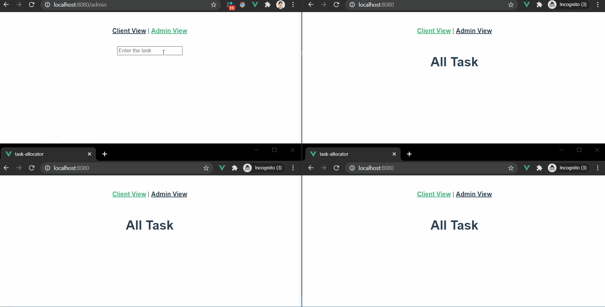

# Task Allocation

Multi-user, Multi-hierarchy app for task allocation. It is still in development [WIP]🚧

**Current Progress**



# Features
- Getting tasks assigned in real time across the users

### Tech stack
- VueJS
- Express, Socket.IO

### Developement setup

- Fork and clone the repo
- For front-end, run ```yarn``` in the app directory, then run ```yarn serve```
- For Back-end, run ```yarn``` then, nodemon ```main.js```